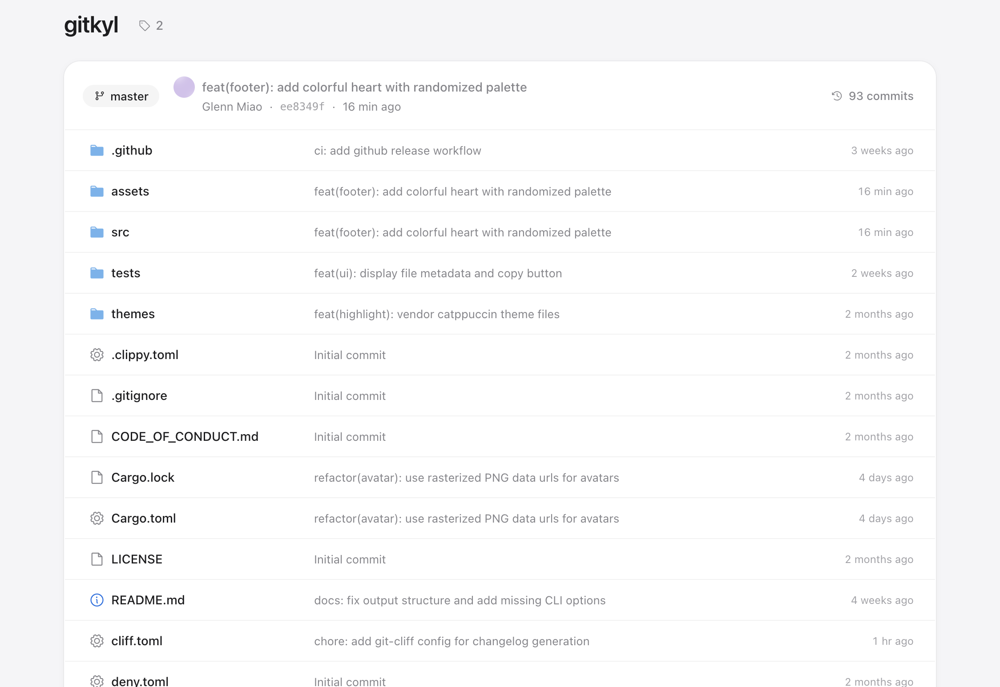

# Gitkyl

Gitkyl **[GIT-kul]** is a static site generator for git repositories. Pure Rust.



## Install

```bash
cargo install gitkyl
```

## Use

```bash
gitkyl                                         # current repo → ./dist
gitkyl /path/to/repo                           # specific repo
gitkyl . -o site                               # custom output
gitkyl --name "My Project" --owner "username"  # custom metadata
gitkyl --theme Catppuccin-Mocha                # dark theme
gitkyl --theme base16-ocean.light              # built-in theme
gitkyl --no-open                               # skip auto-open browser
```

### Theme Options

**Included themes:**
- `Catppuccin-Latte` (default) - Modern warm light theme
- `Catppuccin-Mocha` - Modern dark theme
- `InspiredGitHub` - GitHub-style light theme
- `base16-ocean.light`, `base16-ocean.dark` - Cool modern themes
- `Solarized (light)`, `Solarized (dark)` - Eye-strain optimized

**Custom themes:**
```bash
gitkyl --theme path/to/custom.tmTheme   # External .tmTheme file
```

## Output Structure

```
dist/
├── index.html                     # Repository home
├── assets/                        # CSS bundles
├── tree/master/src.html           # Directory listing
├── blob/master/src/main.rs.html   # Code file
├── blame/master/src/main.rs.html  # Blame view
├── commit/abc1234.html            # Commit detail with diff
├── commits/master/page-1.html     # Commit history
└── tags/index.html                # Tag listing
```

## Build

```bash
cargo build --release     # target/release/gitkyl
cargo test                # run all tests
cargo fmt                 # format code
cargo clippy              # lint
```

---

BSD-3-Clause · lemorage
